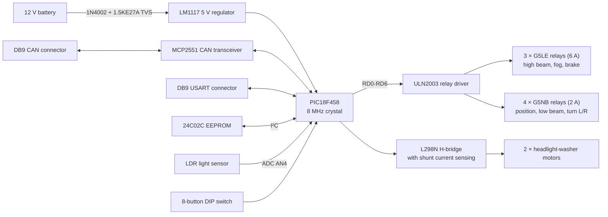

# CAN-Bus Car Lights PCB

**A 2-layer KiCad board that drives a car's exterior lights and headlight-washer motors from a 12 V battery, built around a PIC18F458 with CAN, USART and I²C interfaces.**


## Overview

Group project for *Eines de Disseny* (Design Tools), part of the Electronic & Telecommunications Engineering degree at the Universitat de Barcelona (spring 2023). The brief was to design the electronics module that controls a car's exterior lighting. The board had to:

- regulate the car-battery voltage down to a supply for the logic on the board;
- provide CAN and USART communication, plus an SPI or I²C bus;
- switch the car's exterior lights (high beam, low beam, position, fog, brake, left/right turn signals);
- turn the low-beam and position lights on automatically when a light sensor detects darkness;
- drive the headlight-washer motors.

The repository has the full KiCad schematic and PCB layout, the bill of materials with cost estimates, and the project presentation. **It is a hardware design project.** There is no firmware, and this repository holds no record of the board being manufactured or tested.

## What we built

- **A full schematic** (`Car_lights.kicad_sch`), split into functional blocks: voltage regulator, microcontroller, clock, connectors and reset, CAN bus, EEPROM, light buttons, light sensor, relay current driver, relays, and motor driver.
- **A routed 2-layer PCB** (`Car_lights.kicad_pcb`), 126.1 mm × 134.1 mm, with 84 footprints, 371 track segments, 102 vias and 9 copper zones. The board went from 4 layers to 2 after the professors reviewed it (project change log, 19/04/2023).
- **Track widths set by current**, using custom net classes. Signal nets use 0.25–0.3 mm tracks. The 2 A motor nets use 0.8 mm, the battery and power-ground nets use 1.0–2.0 mm, the 3 A relay outputs use 1.4 mm and the 8 A relay outputs use 4.0 mm.
- **A bill of materials with costs** (`Components_budget.xlsx`) for batches of 10, 50, 1,000 and 20,000 boards.

## How it works




| Block | Part | Role (from the presentation and datasheets) |
|---|---|---|
| Microcontroller | PIC18F458-I/P (40-pin DIP) | Built-in CAN module, I²C/SPI/USART, ADC |
| Power | LM1117S-5.0 | Takes 4.75–15 V in and gives a fixed 5 V out, up to 800 mA. A 1N4002 gives reverse-polarity protection, a 1.5KE27A TVS suppresses transients, and a ferrite bead filters the supply |
| CAN | MCP2551-I/P | CAN 2.0B transceiver, connected through a DB9 connector |
| Memory | 24C02C/P | I²C EEPROM |
| Relay driver | ULN2003 | Darlington array, 500 mA per channel. Freewheel diodes protect the relay coils |
| Relays | G5LE-1A4-CF (×3), G5NB-1A (×4) | High-current (6 A) and low-current (2 A) light outputs |
| Motor driver | L298N | Dual full H-bridge for the two washer motors (motor spec in the presentation: RS-550, 12 V, 1.5 A), with WSMS2908 current-sense shunts and flyback diodes |
| Sensing and input | LDR + potentiometer, 9-way DIP switch | Automatic light activation by darkness; manual light buttons |

### Schematic


## Results

These figures come from the cost analysis in `PCBcarlights_presentation.pdf` (slides 18–20) and `Components_budget.xlsx`:

| Batch size | Components per board | PCB fabrication + assembly per board | Total per board |
|---|---|---|---|
| 10 | €48.46 | €10.68 | €59.14 |
| 50 | €43.10 | €3.67 | €46.77 |
| 1,000 | €33.47 | €1.25 | €34.72 |
| 20,000 | €31.90 | €1.21 | €33.11 |

The two most expensive parts are the PIC18F458 (about €9.83 each at a batch of 10) and the L298N (about €9.94 each).

## Tech stack

- **EDA:** KiCad 7 (eeschema / pcbnew)
- **Key ICs:** Microchip PIC18F458, MCP2551, 24C02C; TI LM1117, ULN2003; ST L298N; Omron G5LE / G5NB relays
- **Interfaces:** CAN 2.0B, USART, I²C, ADC

## Repository structure

```
.
├── Car_lights.kicad_pro          # KiCad project
├── Car_lights.kicad_sch          # Schematic
├── Car_lights.kicad_pcb          # 2-layer PCB layout
├── Car_lights.kicad_prl          # KiCad local project settings
├── Components_budget.xlsx        # BOM and cost per batch size
├── PCBcarlights_presentation.pdf # Project presentation (Catalan)
└── imgs/                         # Block diagram, schematic and PCB screenshots
```

## Getting started

1. Install [KiCad](https://www.kicad.org/) 7.0 or later.
2. Clone the repository and open the project:
   ```bash
   git clone https://github.com/sergimarsol/CAN-Bus-Car-Lights-PCB.git
   cd CAN-Bus-Car-Lights-PCB
   kicad Car_lights.kicad_pro
   ```
3. Open the schematic or PCB editor from the project window. Use **View → 3D Viewer** in the PCB editor to see the 3D model of the board.

## Team and acknowledgements

- **Paula Hernández**: block diagram, component selection, final PCB revision
- **Arnau Piqué**: schematic (driver–relay and EEPROM connections, light sensor), final 2-layer PCB revision
- **Sergi Marsol**: first PCB layout version, project presentation

These roles come from the group's change log. Thanks to the *Eines de Disseny* teaching staff at the Universitat de Barcelona for their design reviews.

## License

Released under the [MIT License](LICENSE).
